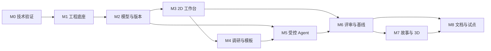
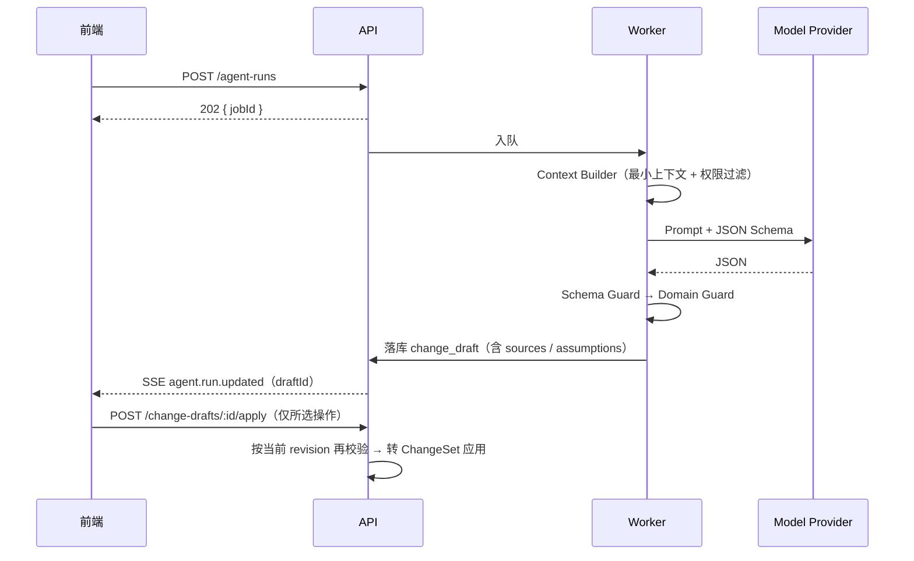
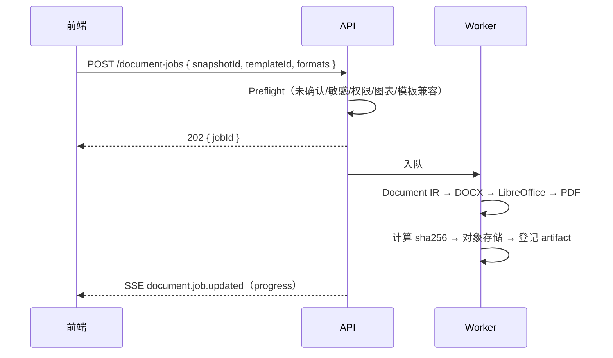

# 需求调研工作台 · 具体实施方案

| 项目 | 内容 |
| --- | --- |
| 文档版本 | v1.0 |
| 文档性质 | 研发落地与排期执行计划 |
| 编制日期 | 2026年10月4日 |
| 上游依据 | 《需求调研工作台产品设计文档》v1.0（决定"做什么"）<br>《需求调研工作台开发方案》v1.0（决定"怎么做"） |
| 本文件职责 | 把上游两份文档翻译为**可排期、可分工、可领取、可验收**的落地计划 |
| 状态 | 待产品负责人 / 总指挥确认 |

---

## 0. 本文件定位与使用方式

### 0.1 三份文档的分工

| 文档 | 回答的问题 | 变更权 |
| --- | --- | --- |
| 产品设计文档 v1.0 | 做什么：范围、页面、对象、验收标准 | 产品负责人 |
| 开发方案 v1.0 | 怎么做：技术选型、架构、契约、里程碑定义 | 总指挥 |
| **本实施方案 v1.0** | **谁、在什么顺序、用多少工作量、按什么证据交付** | 总指挥 + 产品负责人 |

**冲突规则**：本文件不得与上游两份文档冲突。若冲突，以上游为准并停止实现，提交变更单裁定。本文件所有工期、人力、任务粒度均为**建议值**，确认后写入基线。

### 0.2 阅读路径

| 角色 | 必读章节 |
| --- | --- |
| 产品负责人 | 1、6.1（M0）、11、12 |
| 总指挥 | 1、2、3、4、5、9、10、11 |
| 开发者 | 2、3、4、5、6、7、8、12 |
| 测试人员 | 6（各里程碑验收标准）、8 |
| 实施顾问 | 6.4 / 6.5（调研与模板）、12 |

### 0.3 本文件相对开发方案新增的内容

1. **工作量与工期估算**：每个里程碑的人日、总工期、关键路径、并行策略。
2. **任务粒度细化**：任务拆到"可一天内完成、有明确产出物、可被复核"。
3. **数据库物理设计线索**：完整表清单（35 张）、分组、关键约束、索引方向。
4. **落地实现要点**：多租户隔离、乐观锁、Outbox、确认失效、快照哈希的具体做法。
5. **周节奏与协作机制**：例会、提交包、复核闭环、变更单流程。
6. **第 1 周立即行动清单**：文档批准当天即可开工。

---

## 1. 实施总览

### 1.1 目标与成功定义

唯一验收锚点是开发方案的 **MVP 完成定义**：

> 一名没有实施经验的新员工，仅依赖系统内置向导与话术，能建立项目、完成模拟访谈、搭建含分支和异常的流程、处理阻断项并生成报告；同一场景在客户故事视图、专业 2D 视图、3D 导览和导出文档中语义一致；基线不可被普通编辑覆盖；所有 AI 修改先以差异草案呈现。

### 1.2 范围边界

| 首版必须做 | 首版不做（保留接口） |
| --- | --- |
| 项目 / 场景 / 成员 / 生命周期 | 模板市场、模板订阅 |
| 统一语义模型 + ChangeSet / Revision / Snapshot / Baseline | 完整 BPMN 2.0、补偿事件 |
| 2D 精确建模（人物、事项、决策、异常、并行、子流程、数据对象） | 3D 精确编辑、数字人、物理仿真 |
| 岗位话术库 + 访谈记录 + 证据 + 事实候选 | 实时会议机器人、实时录音转写 |
| 受控 Agent：追问、建模草案、完整性检查、通俗解释 | 全自动方案生成、多 Agent 自治 |
| 评论 / 问题 / 决议 / 确认 / 批准 | 复杂外部审批流、跨组织审批 |
| 客户故事 2D + 基础 3D 导览 + 无损降级 | 多人 3D 共游、超写实资产 |
| 一键文档：现状调研报告 + 需求清单（DOCX/PDF） | 通用富文本排版编辑器 |
| OIDC 身份、租户隔离、权限、审计、来源状态 | 细粒度字段级权限、SSO 目录同步 |
| 行业模板机制 + 首个行业知识包 | 海量行业模板内容 |

### 1.3 实施原则（贯穿全程，不可妥协）

| 编号 | 原则 | 落地检查点 |
| --- | --- | --- |
| P1 | 唯一事实源 | 任何模块不得另存业务表；2D/3D/文档只读 Snapshot 或 API |
| P2 | 写入单一入口 | 模型写入只能经 Command/ChangeSet 服务；画布、Agent、导入、模板实例化均如此 |
| P3 | AI 无写权限 | Agent 只能产出 ChangeDraft，应用时二次校验 revision / 权限 / 来源 |
| P4 | 事实与推断分离 | 每条操作必须带 `sourceRefs` 与 `confidenceState`；无来源不得入基线 |
| P5 | 契约先行 | 先提交 OpenAPI + Schema + 示例，再实现界面；客户端由契约生成 |
| P6 | 闭环优先于广度 | 每个里程碑必须能端到端演示，不用未验收的后续界面掩盖底层缺陷 |
| P7 | 阈值来自实测 | 性能数字由 M0 基准项目测量后冻结，不凭空设定 |

### 1.4 里程碑路线与依赖



| 里程碑 | 目标 | 进入条件 | 退出条件（摘要） |
| --- | --- | --- | --- |
| M0 技术验证 | 验证四个最高风险 | 产品设计文档为基线 | 4 个 Spike 同模型驱动 + 阈值获确认 |
| M1 工程底座 | 可复现、安全登录、可观测 | M0 通过 | 干净环境一条命令启动 |
| M2 模型与版本 | 统一事实源可追溯 | M1 通过 | 差异 / 修订 / 快照闭环 |
| M3 2D 工作台 | 手工精确建模可用 | M2 通过 | 完成含分支与异常流程 + 新手首步 |
| M4 调研与模板 | 新人能按话术采集事实 | M3 通过 | 模板→访谈→事实候选→证据 |
| M5 受控 Agent | 自然语言安全生成草案 | M2 / M4 通过 | 中文金样例与人工合并通过 |
| M6 评审与基线 | 多人确认形成边界 | M3 / M5 通过 | 批准快照不可变 |
| M7 故事与 3D | 普通客户可理解 | M6 通过 | 3D/2D 语义等价且可降级 |
| M8 文档与试点 | 一键成文并真实试点 | M6 / M7 通过 | 完整 Odoo 场景端到端验收 |

### 1.5 工作量与工期估算（建议值，待确认）

按 **1 名全职全栈开发者** 为基准单位（1 人日 = 1 pd）。

| 里程碑 | 人日 | 日历周（单人） | 主要产出 |
| --- | ---: | ---: | --- |
| M0 技术验证 | 10 | 2 | 4 个 Spike、基准项目、ADR-001~006、阈值建议 |
| M1 工程底座 | 10 | 2 | 单仓、Compose 栈、OIDC/BFF、CI |
| M2 模型与版本 | 15 | 3 | 核心 Schema、Command/Query、校验器、Snapshot |
| M3 2D 工作台 | 20 | 4 | 三栏工作台、节点/关系编辑、新手向导 |
| M4 调研与模板 | 15 | 3 | 话术、访谈记录、证据、模板机制、完成度 |
| M5 受控 Agent | 15 | 3 | Provider Adapter、四类能力、草案审阅 UI |
| M6 评审与基线 | 12 | 2.5 | 评论/问题/决议/确认、评审中心、SSE、基线 |
| M7 故事与 3D | 15 | 3 | SceneProjection、故事线编辑、3D 导览、降级 |
| M8 文档与试点 | 15 | 3 | Document IR、DOCX/PDF、预检脱敏、真实试点 |
| **小计** | **127** | **≈ 25.5 周** | |
| 缓冲（约 20%） | 25 | ≈ 5 周 | 返工、Spike 失败重做、客户反馈 |
| **合计** | **≈ 152** | **≈ 30 周（单人）** | |

**并行方案对比**

| 配置 | 预计工期 | 说明 |
| --- | --- | --- |
| 1 名全栈 | ≈ 30 周 | 最保守；M0 不可压缩 |
| 1 全栈 + 1 前端 | ≈ 20~22 周 | M3/M4/M7 前端密集型任务并行；M2 仍为瓶颈 |
| 2 全栈（前后端分工） | ≈ 16~18 周 | 需 M2 契约冻结后才真正并行，否则返工放大 |
| 加 1 名设计/内容（兼职） | 不缩短关键路径 | 行业知识包与话术需实施专家投入，属内容工作 |

**关键路径**：M0 → M1 → M2 → M3 → M6 → M8。
M4 / M5 / M7 可挂在关键路径旁并行，但**不得提前于其依赖里程碑**。

### 1.6 排期建议（以 2 人配置、18 周为例）

| 周次 | 主干工作 | 并行工作 |
| --- | --- | --- |
| W1–W2 | M0 四个 Spike + ADR | 产品负责人确认试点场景与模板范围 |
| W3–W4 | M1 单仓 + Compose + OIDC/BFF + CI | 内容侧准备通用贸易知识包初稿 |
| W5–W7 | M2 数据模型 + Command/Query + 校验器 + Snapshot | 前端搭建 app-shell、契约客户端生成 |
| W8–W11 | M3 2D 工作台 + 新手向导 | M3 后期起可预研 M5 的 Provider Adapter |
| W12–W14 | M4 调研室 + 模板 + 证据 | M5 Agent 编排与 Schema 并行 |
| W15–W16 | M6 评审与基线 + SSE | M7 SceneProjection 投影器先行设计 |
| W17–W18 | M7 3D 导览 + 降级 | M8 Document IR 设计冻结 |
| W19–W21 | M8 文档渲染 + 预检脱敏 | 真实 Odoo 试点执行 |

> 排期以里程碑验收而非日历为唯一推进单位；若某里程碑阻断项未关闭，宁可顺延也不进入下一里程碑。

---

## 2. 技术基线固化

### 2.1 候选技术栈（M0 结束后锁定精确版本）

| 层 | 选择 | 候选版本 | 锁定方式 |
| --- | --- | --- | --- |
| 运行时 / 仓库 | Node.js LTS、TypeScript、pnpm workspace | Node 22.x / TS 5.x / pnpm 9.x | `.nvmrc` + pnpm-lock |
| Web 框架 | React + Vite | React 19 / Vite 6.x | lockfile |
| 企业 UI | Ant Design + CSS Variables | AntD 5.x | lockfile |
| 状态与请求 | TanStack Query + Zustand | 最新稳定 | lockfile |
| 2D 画布 | @xyflow/react（React Flow） | 12.x | lockfile |
| 3D | Three.js + React Three Fiber + Drei | R3F 9.x | lockfile |
| API | NestJS + Fastify Adapter | Nest 11.x | lockfile |
| 契约 | OpenAPI 3.1 + 生成式客户端 | — | 生成无 diff 门禁 |
| 数据访问 | Drizzle ORM + 显式 SQL migration | 0.3x | lockfile |
| 主库 | PostgreSQL + pgvector | 16.x | 容器镜像摘要 |
| 队列 / 缓存 | Redis + BullMQ | Redis 7.x / BullMQ 5.x | 镜像摘要 |
| 文件 | S3 API；本地 MinIO | MinIO 最新稳定 | 镜像摘要 |
| 身份 | 标准 OIDC；默认 Keycloak | Keycloak 26.x | 镜像摘要 |
| Agent | 自研编排 + Provider Adapter + JSON Schema | — | ADR-005 |
| 文档 | Document IR + docx 库 + LibreOffice Worker | docx 9.x | ADR-008 |
| 观测 | OpenTelemetry + Prometheus + structured log | — | ADR |
| 测试 | Vitest / RTL / Playwright / Testcontainers / k6 | — | CI 门禁 |

**版本策略**：不追最新版。M0 先跑兼容矩阵（Node × Vite × Nest × Drizzle × R3F × Keycloak），通过后把精确版本写入 lockfile、容器镜像摘要与 ADR；此后只按计划升级。

### 2.2 已定技术决策（不再重复讨论）

1. TypeScript 模块化单体 + 独立异步 Worker，不拆微服务。
2. PostgreSQL 是事实主库；Redis 只做队列、锁、短期缓存与 SSE fan-out。
3. 语义写入使用 `If-Match: "rev-{n}"` + `Idempotency-Key`，不用"最后写入覆盖"。
4. 协作使用乐观锁 + revision；首版不上 CRDT / Yjs。
5. Agent 只产出 ChangeDraft，应用时服务端二次校验。
6. 文档与 3D 只读 Snapshot；基线不可原地修改。
7. Docker Compose 为私有部署基线，不绑定单一云厂商。

### 2.3 明确否决项（重新评估触发条件）

| 方案 | 暂不选择 | 重新评估触发 |
| --- | --- | --- |
| Next.js 全栈 | 编辑器是长驻 SPA，SSR 价值有限 | 出现公开 SEO 页面 |
| Python 主后端 | 契约与单人维护需额外语言切换 | 复杂文档 / AI 专库不可替代 |
| Go 首版 API | 性能非当前瓶颈，迭代速度更关键 | 实测 API CPU 成为瓶颈 |
| Neo4j | PostgreSQL 已满足关系查询 | 跨项目图分析成为核心 |
| Kafka | 事件量未证明 | Outbox/Redis 无法满足可靠性 |
| Yjs / CRDT | 业务对象冲突非纯文本合并 | 真实并发编辑频繁阻塞 |
| LangChain 类框架做核心 | 隐式链路、升级与调试成本 | 某组件经 P0 证明显著节省工作 |
| 独立向量库集群 | 数据量与检索需求未证明 | pgvector 无法满足召回质量 |

### 2.4 环境与工具链

| 项 | 要求 |
| --- | --- |
| 本地开发 | 一条命令起全栈：`pnpm dev:stack`（Compose） + `pnpm dev`（web/api/worker） |
| 容器栈 | PostgreSQL、Redis、MinIO、Keycloak、ClamAV，全部带 healthcheck |
| Node 版本 | `.nvmrc` + `package.json#engines` 双重约束 |
| 编辑器约束 | `.editorconfig`、ESLint、Prettier、`tsc --noEmit` |
| 密钥管理 | 本地 `.env.example`；生产走 secret store；仓库零密钥 |
| 目标设备 | M0 确定真实办公机与浏览器清单，写入 ADR 与性能基线 |

### 2.5 M0 需产出的 ADR

| ADR | 主题 | 初始裁定方向 |
| --- | --- | --- |
| ADR-001 | 首版架构形态 | TS 模块化单体 + Worker |
| ADR-002 | 事实与版本 | ChangeSet / Revision / Snapshot |
| ADR-003 | 2D 画布 | React Flow 仅作视图适配层 |
| ADR-004 | 3D | R3F + SceneProjection + 2D 降级 |
| ADR-005 | Agent | 自研编排 + Provider Adapter + JSON Schema |
| ADR-006 | 协作 | 乐观锁 + SSE，暂不上 CRDT |
| ADR-007 | 身份 | OIDC + BFF Session |
| ADR-008 | 文档 | Document IR + DOCX + LibreOffice PDF |
| ADR-009 | 检索 | PostgreSQL / pgvector，暂不上独立搜索集群 |

---

## 3. 工程结构落地

### 3.1 单仓目录结构

```text
odoo-ReqAtlas/
├─ apps/
│  ├─ web/                    # React SPA（长驻编辑器）
│  ├─ api/                    # NestJS + Fastify，模块化单体
│  └─ worker/                 # BullMQ workers（文档、解析、索引、Agent）
├─ packages/
│  ├─ contracts/              # OpenAPI schemas + 生成的 TS 客户端
│  ├─ domain/                 # entities / commands / validators / policies（零框架依赖）
│  ├─ db/                     # Drizzle schema、migrations、repositories
│  ├─ ui/                     # 共享企业组件
│  ├─ canvas/                 # React Flow 适配层（不含业务真相）
│  ├─ presentation-3d/        # SceneProjection 渲染器
│  ├─ document-ir/            # 格式无关文档内容模型
│  ├─ observability/          # trace / log / metric 辅助
│  └─ testkit/                # factories、fixtures、fake providers
├─ docs/
│  ├─ 需求调研工作台-具体实施方案.md   # 本文件
│  ├─ adr/                    # ADR-001 ~ ADR-009
│  ├─ api/                    # 生成产物与示例
│  └─ runbook/                # 运维与操作手册
└─ infra/
   └─ compose/                # 本地 / 私有试点编排
```

### 3.2 依赖方向（用工具强制，不靠自觉）

| 规则 | 强制手段 |
| --- | --- |
| `domain` 不依赖 NestJS / React / DB 驱动 / 模型 SDK | ESLint `no-restricted-imports` + 依赖图检查 |
| `api` / `worker` 依赖 `domain` 与 `db`；`db` 实现 `domain` 定义的 repository port | 架构测试（dependency-cruiser） |
| `web` 只依赖生成的 API client、`ui`、`canvas`、`presentation-3d` | 禁止导入服务端实现 |
| 模块之间不直接访问对方数据表 | 跨模块通过 application service 或 query port |
| 禁止循环依赖 | CI 门禁 |

### 3.3 编码规范与质量工具

- `tsconfig` 全仓 `strict: true`，禁止 `any` 逃逸（`noImplicitAny`、`strictNullChecks`）。
- 统一错误模型：`application/problem+json` + 稳定 error code（见开发方案附录 A）。
- 统一响应包装：`{ data, meta: { requestId, projectRevision } }`。
- 所有命令接口必须有 `Idempotency-Key`、所有语义写入必须有 `If-Match`。
- 提交前钩子：format → lint → typecheck → 受影响单测。

### 3.4 分支、提交与版本

| 项 | 规则 |
| --- | --- |
| 主分支 | `main` 始终可启动；里程碑在 `feature/mX-*` 分支实现 |
| 提交 | 小步、可回滚；说明行为变化；不混入无关格式化 |
| 版本 | MVP 前 `0.x`；每个里程碑打 tag `m0` … `m8` |
| 数据库 | 每次 Schema 变化附 migration + 回滚/恢复说明 + 测试 |
| API | 破坏性变更先更新契约与客户端；`/v1` 内不静默改语义 |

---

## 4. 数据模型落地

### 4.1 表清单（35 张，按域分组）

| 域 | 表 | 说明 |
| --- | --- | --- |
| 租户与身份（3） | `tenant`、`user_identity`、`membership` | 所有业务表带 `tenant_id` |
| 项目（4） | `project`、`project_member`、`scenario`、`project_revision` | `project.code` 租户内唯一 |
| 统一模型（5） | `model_object`、`model_relation`、`view`、`view_layout`、`validation_finding` | 事实主链核心 |
| 版本与治理（5） | `change_set`、`change_operation`、`snapshot`、`baseline`、`audit_event` | 追加式、不可变 |
| 调研与证据（5） | `interview_session`、`interview_segment`、`evidence`、`evidence_link` | 录音独立授权 |
| 协作（5） | `comment`、`issue`、`decision`、`confirmation`、`approval` | 绑定 `object_rev` / `snapshot_id` |
| 模板与知识（4） | `template_package`、`template_item`、`knowledge_entry`、`prompt_spec` | 发布后不可原地改 |
| Agent（3） | `agent_run`、`change_draft`、（`change_operation` 复用） | 草案复用统一操作结构 |
| 文档（3） | `document_template`、`document_job`、`document_artifact` | 模板冻结、产物不可变 |

### 4.2 关键表设计要点

**`model_object`（事实主链核心）**

| 列 | 类型 | 约束 |
| --- | --- | --- |
| `id` | text/uuid | 主键，永不复用 |
| `tenant_id` / `project_id` | text | 复合外键，同租户校验 |
| `kind` | enum | `role/person/organization/activity/decision/start/end/parallel/wait/subprocess/exception/system/data_object/current_fact/problem/target/requirement/solution_candidate/term` |
| `code` | text | `project_id + kind` 内唯一（`ROLE-001` 等） |
| `title` | text | 可重复 |
| `state` | enum | `draft/pending_confirmation/needs_change/confirmed/approved/deprecated` |
| `source_status` | enum | `user_statement/material_extracted/consultant_judgment/agent_inference/confirmed_fact/approved_requirement` |
| `payload` | jsonb | 按 kind 的 Schema 校验扩展字段 |
| `object_rev` | int | 每次语义修改 +1；确认绑定此值 |
| `deprecated_at` / `replaced_by` | — | 基线对象只允许废止 |

索引方向：`(project_id, kind, state)`、`(project_id, code)` 唯一、`payload` 按需 GIN。

**`model_relation`**

- `kind` 枚举：`belongs_to / performs_R / accountable_A / consulted_C / informed_I / flow_to / triggers / consumes / produces / uses_system / has_exception / supported_by / derived_from / resolves / maps_to / confirms / replaces`
- 端点必须存在且未废止；删除对象前先生成引用影响分析。

**`change_set` + `change_operation`（写入唯一凭证）**

- `change_set`：`base_seq`（提交时的 project_revision）、`status`（draft/applied/rejected）、`actor`、`reason`、`source`。
- `change_operation`：`op`、`target_type/id/temp_id`、`before`、`after`、`source_refs`、`reason`、`confidence_state`。
- 应用规则：Schema → 权限 → `If-Match` → 幂等键 → tempId 解析 → **单事务**全量应用；任一阻断规则失败整体回滚，不允许半成功。
- 服务端自行补齐 `before` 值并保存；客户端提供的 `before` 仅用于冲突提示。

**`snapshot` / `baseline`**

- `snapshot`：`revision_seq`、`type`、`manifest_uri`、`sha256`；写入对象存储后计算哈希，同一事务登记元数据；创建后不可变。
- `baseline`：同一范围仅一个当前基线；批准后只能通过变更分支更新。

**`confirmation`（确认失效机制）**

- 绑定 `object_id + object_rev`。对象语义被修改后 `object_rev` 变化 → 旧确认保留历史但不再有效 → 界面回到"待确认"并通知。

**`agent_run` / `change_draft`**

- `agent_run` 固定 `prompt_version` / `schema_version` / `provider` / `model`；日志只记哈希、大小、耗时、错误分类，不记敏感全文。
- `change_draft`：`operations`、`assumptions`、`findings`、`based_on_revision`；接受后生成 ChangeSet，`assumptions` 永远不能进入基线。

### 4.3 多租户与项目隔离实现方式

| 层 | 做法 |
| --- | --- |
| 数据库 | 所有业务表 `tenant_id NOT NULL`；跨表外键同时包含 `tenant_id`（复合外键）或由策略校验同租户 |
| 应用层 | repository **默认携带 tenant context**，调用方不得自行拼 tenant 条件 |
| 项目层 | 任何对象不得跨项目引用；`CROSS_PROJECT_REFERENCE` 规则阻断 |
| 可选加固 | 评估 PostgreSQL RLS 作为第二道防线（M1 决策，不默认启用） |
| 证据层 | 证据对象级权限独立于模型对象权限 |
| 验证 | `security-fixture`：两个租户 + 重名项目 + 不同权限 + 敏感证据，覆盖越权矩阵 |

### 4.4 版本、锁与并发落地要点

| 场景 | 做法 |
| --- | --- |
| 并发语义写入 | 应用 ChangeSet 时对 `project_revision` 行加锁；`base_seq` 不匹配返回 `409 REVISION_CONFLICT` |
| 重复提交 | `Idempotency-Key` 命中且请求体不同 → `409 IDEMPOTENCY_MISMATCH`；相同则返回原结果 |
| 布局拖动 | 短时间窗口合并为 `ViewLayoutPatch`；只有对象语义、关系、关键布局保存或显式保存才形成 revision |
| 软删除 | 默认进项目回收站；已入基线/正式文档的对象只能标记废止并记录替代对象 |
| 恢复 | 按 Snapshot 恢复读取；ChangeSet 历史可查看、可逐项审阅 |

### 4.5 迁移与 seed

| 项 | 要求 |
| --- | --- |
| 迁移 | 每个 Schema 变化附 migration + 回滚/恢复说明；空库迁移与上一版本升级均需测试 |
| 固定 seed | `demo-trade`、`demo-manufacturing`、`agent-golden`、`document-golden`、`security-fixture` |
| 可复现 | 从干净环境可重建；seed 名称与重建方法写入每个里程碑提交包 |
| 禁止入库 | 秘密、临时文件、本地绝对路径 |

---

## 5. 接口契约落地

### 5.1 通用协议

| 项 | 裁定 |
| --- | --- |
| Base URL | `/api/v1` |
| 格式 | JSON UTF-8；文件走预签名上传 |
| 认证 | OIDC Access Token；API 校验 issuer / audience |
| 授权 | 租户角色 + 项目角色 + 对象分类 |
| 并发 | 语义写入必须 `If-Match: "rev-{n}"` |
| 幂等 | POST / 命令必须 `Idempotency-Key` |
| 追踪 | 每个响应返回 `X-Request-Id` |
| 分页 | cursor + limit，不使用 offset |
| 错误 | `application/problem+json` + 稳定 error code |
| 异步 | `202` + `jobId`；SSE 推送状态 |

### 5.2 路由总表

**① 项目与场景（8）**

| 方法 | 路径 | 关键规则 |
| --- | --- | --- |
| POST | `/projects` | 幂等；默认 `draft` |
| GET | `/projects/:id` | 返回权限与 revision |
| PATCH | `/projects/:id` | `If-Match`；状态机校验 |
| POST | `/projects/:id/members` | 仅负责人/管理员 |
| GET | `/projects/:id/scenarios` | cursor；状态筛选 |
| POST | `/projects/:id/scenarios` | 可从模板草案应用 |
| PATCH | `/scenarios/:id` | `If-Match`；语义写入 |
| POST | `/scenarios/:id/start-review` | 先跑阻断规则 |

**② 模型与版本（9）**

| 方法 | 路径 | 返回 |
| --- | --- | --- |
| GET | `/scenarios/:id/model` | ModelBundle + revision |
| GET | `/objects/:id` | ObjectDetail（含来源） |
| POST | `/projects/:id/change-sets` | applied ChangeSet |
| POST | `/change-drafts/:id/validate` | findings |
| POST | `/change-drafts/:id/apply` | ChangeSet + revision |
| POST | `/projects/:id/snapshots` | 202 SnapshotJob |
| GET | `/snapshots/:id/bundle` | 只读 ModelBundle |
| POST | `/snapshots/:id/baselines` | Baseline |
| GET | `/projects/:id/revisions` | 修订历史（cursor） |

**③ Agent（6）**

| 方法 | 路径 | 规则 |
| --- | --- | --- |
| POST | `/projects/:id/agent-runs` | scope + task + input |
| GET | `/agent-runs/:id` | 不返回越权上下文 |
| POST | `/agent-runs/:id/answers` | 回答澄清，继续同一 run |
| POST | `/agent-runs/:id/cancel` | 已产草案保留 |
| GET | `/change-drafts/:id` | 按操作审阅 |
| POST | `/change-drafts/:id/apply` | 再次校验 revision |

**④ 文件与证据（6）**

| 方法 | 路径 | 状态流转 |
| --- | --- | --- |
| POST | `/files/initiate` | `initiated` |
| PUT | `<presigned-url>` | `uploaded` |
| POST | `/files/:id/complete` | `scanning` |
| GET | `/files/:id` | `ready/quarantined/failed` |
| POST | `/evidence` | `active` |
| POST | `/evidence/:id/links` | 关联模型对象 |

**⑤ 协作与评审（5）**

| 方法 | 路径 | 阻断条件 |
| --- | --- | --- |
| POST | `/objects/:id/comments` | 对象不可见 |
| POST | `/objects/:id/confirmations` | `object_rev` 不匹配 |
| POST | `/snapshots` | 存在数据错误 |
| POST | `/snapshots/:id/approve` | 阻断项 / 无权限 |
| GET | `/review/queue` | 待确认 / 问题 / 差异 / 决议 / 批准 |

**⑥ 文档（4）**

| 方法 | 路径 | 说明 |
| --- | --- | --- |
| POST | `/document-jobs` | 未选快照/模板则拒绝 |
| GET | `/document-jobs/:id` | 进度与章节错误 |
| GET | `/artifacts/:id/download` | 短期签名 URL |
| GET | `/document-templates` | 模板与版本列表 |

**⑦ 实时（SSE）**

事件：`project.revision.created`、`agent.run.updated`、`document.job.updated`、`file.updated`、`review.updated`、`notification.created`。SSE 必须鉴权、支持重连游标与事件去重。

### 5.3 三条最关键写入链路

```mermaid
sequenceDiagram
  participant U as 前端
  participant A as API
  participant D as Domain
  participant P as PostgreSQL
  U->>A: POST /change-sets (If-Match, Idempotency-Key, operations[])
  A->>D: 校验 Schema / 权限 / 幂等
  D->>P: BEGIN; 锁 project_revision; 校验 base_seq
  D->>D: Validator 全量规则（阻断则整体回滚）
  D->>P: 应用对象/关系; revision+1; 写 Outbox; 写 audit_event; COMMIT
  A-->>U: 200 { data, meta.projectRevision } + operationId→真实ID 映射
```





### 5.4 契约先行工作流

1. 在 `packages/contracts` 修改 OpenAPI / JSON Schema。
2. 生成客户端；`git diff` 必须为空（CI 门禁）。
3. 提交示例请求/响应，纳入契约测试。
4. 后端实现路由，前端消费生成客户端，禁止手写请求类型。
5. 破坏性变更先更新契约与客户端，再改实现。

---

## 6. 里程碑实施细则

> **执行方式**：只领取当前里程碑；先提交契约、数据与测试，再实现完整界面。每项完成后留下**可运行证据**，不以截图代替自动化测试，不以覆盖率代替业务验收。

### 6.1 M0 技术验证（10 pd）

| 项 | 内容 |
| --- | --- |
| 目标 | 验证四个最高风险，冻结技术基线与性能阈值 |
| 依赖 | 产品设计文档 v1.0 为基线 |

| 编号 | 任务 | 产出物 | 人日 |
| --- | --- | ---: | ---: |
| M0-01 | 选定首个真实 Odoo 试点场景，建立 ModelBundle 样本与目标设备表 | 基准项目 JSON + 设备清单 | 1.5 |
| M0-02 | 建立最小 pnpm workspace 与 `spike/` 目录，锁定候选依赖，完成许可证清单 | workspace + SBOM/license report | 1 |
| M0-03 | React Flow 渲染/编辑样本，记录复杂度→帧率/长任务/内存/保存耗时 | 性能曲线 + 瓶颈清单 | 2 |
| M0-04 | 同一 ModelBundle → SceneProjection → 基础 3D 导览，并完成 2D 降级 | 3D Spike + 降级证明 | 2 |
| M0-05 | fake/real Provider Adapter：结构化输出、Schema 失败、超时、取消 | Adapter + 失败用例 | 1 |
| M0-06 | 最小 ChangeDraft 审阅/应用，证明模型无直接数据库写权限 | 草案→应用闭环 | 1.5 |
| M0-07 | 从不可变样本生成带对象编号的 DOCX/PDF，检查中文字体/分页/重复生成 | 文档 Spike + 两次哈希对比 | 1.5 |
| M0-08 | 提交 ADR-001 ~ ADR-006 | ADR 文档 | 0.5 |
| M0-09 | 汇总实测结果、阈值建议、风险与替代方案提交确认 | M0 验收报告 | 0.5 |

**验收标准**

- 四个 Spike **全部由同一 ModelBundle 驱动**，不允许硬编码演示。
- 每个 Spike 给出可重复执行的测试步骤与实测数据。
- 性能阈值建议、许可证清单、兼容矩阵获总指挥确认。
- **阻断项**：任一 Spike 只能靠硬编码演示，或无法给出可重复测试步骤 → M0 不通过。

**风险**：Spike 时间被 UI 打磨吞掉 → 强制"低保真、先证明机制"，视觉细节推迟到 M3/M7。

---

### 6.2 M1 工程底座与身份（10 pd）

| 项 | 内容 |
| --- | --- |
| 目标 | 干净环境一条命令可启动、登录、可观测 |
| 依赖 | M0 通过 |

| 编号 | 任务 | 验收点 | 人日 |
| --- | --- | --- | ---: |
| M1-01 | 创建 `apps/web`、`apps/api`、`apps/worker` 与 `packages/*`，配置 strict TS 与依赖边界 | 架构测试通过 | 2 |
| M1-02 | Docker Compose：PostgreSQL、Redis、MinIO、Keycloak、ClamAV + healthcheck | 干净环境可复现 | 2 |
| M1-03 | OIDC/BFF 登录、退出、会话轮换、CSRF、防开放重定向、禁用用户 | 安全用例全绿 | 2 |
| M1-04 | tenant context、requestId、traceId、结构化日志、统一错误中间件 | trace 贯穿 API/Worker | 1 |
| M1-05 | Drizzle Schema、migration runner、空库/升级测试、demo seed | 空库迁移成功 | 1.5 |
| M1-06 | OpenAPI 生成 + 前端客户端生成，提交健康/会话契约 | 生成无 diff | 0.5 |
| M1-07 | CI：format、lint、typecheck、unit、migration、secret/dependency scan | CI 全绿 | 1 |

**验收标准**：从空目录执行一条命令完成启动 + 登录 smoke test；日志不含秘密；双租户安全 fixture 可加载。

---

### 6.3 M2 统一模型、差异与版本（15 pd）

| 项 | 内容 |
| --- | --- |
| 目标 | 统一事实源可追溯：差异 / 修订 / 快照闭环 |
| 依赖 | M1 通过 |

| 编号 | 任务 | 验收点 | 人日 |
| --- | --- | --- | ---: |
| M2-01 | 实现 project、scenario、model_object、model_relation、view、view_layout、change_set、change_operation、project_revision、snapshot、baseline、audit_event 表 | 迁移可复现 | 3 |
| M2-02 | 定义对象/关系 kind Schema、字段默认值与兼容升级策略 | Schema 校验可测 | 1.5 |
| M2-03 | Query API + 授权 repository（调用方不得自拼 tenant 条件） | 越权矩阵通过 | 2 |
| M2-04 | Command Pipeline：幂等、`If-Match`、tempId 解析、单事务、Outbox、审计 | 并发/重复请求测试 | 3 |
| M2-05 | 流程/RACI/来源/引用/基线/删除影响规则，每条规则稳定 code | 规则单测全覆盖 | 2 |
| M2-06 | ChangeSet 历史、差异读取、软删除/废止、确认失效 | 确认失效测试 | 1.5 |
| M2-07 | Snapshot 序列化、哈希、对象存储、读取、重复生成测试 | 同 revision 哈希一致 | 1.5 |
| M2-08 | 并发写、重复请求、跨租户引用、事务回滚、恢复测试 | 集成测试全绿 | 0.5 |

**验收标准**

- `If-Match` 不匹配返回 `409 REVISION_CONFLICT`；幂等键冲突返回 `IDEMPOTENCY_MISMATCH`。
- 任一阻断规则失败时事务整体回滚，库中不残留半成功对象。
- 同一 revision 重复生成 Snapshot 内容哈希一致；创建后不可修改。
- 跨租户/跨项目/敏感对象访问均被拒绝并写入审计。

**风险**：规则数量膨胀拖慢进度 → 首版严格按开发方案附录 C 的 12 条规则实现，新增走变更单。

---

### 6.4 M3 2D 模型工作台与新手首步（20 pd）

| 项 | 内容 |
| --- | --- |
| 目标 | 手工精确建模可用；新人无外部帮助完成首步 |
| 依赖 | M2 通过 |

| 编号 | 任务 | 验收点 | 人日 |
| --- | --- | --- | ---: |
| M3-01 | 项目/场景路由、三栏框架、错误边界、权限守卫 | 页面壳可用 | 2 |
| M3-02 | Domain ↔ React Flow Adapter（禁止直接持久化 React Flow JSON） | 语义层隔离测试 | 2.5 |
| M3-03 | 人物、组织、事项、决策、异常、系统、数据对象与首版关系组件 | 全部 kind 可建模 | 4 |
| M3-04 | 属性表单、句式化规则编辑器、RACI 编辑器、来源状态展示 | 双层表达（客户/专业） | 3 |
| M3-05 | 泳道、过滤、聚焦、折叠、自动布局接口、布局单独保存 | 布局不改变语义 | 2.5 |
| M3-06 | 命令缓冲、撤销/重做、自动保存、断线草稿、revision 冲突对话框 | 冲突提示可解释 | 2.5 |
| M3-07 | 客户故事 2D 投影，验证与专业视图对象 ID 一致 | 对象 ID 一致性测试 | 2 |
| M3-08 | 新手向导："拖第一个人物→连第一条流程→看客户视图" | NU-01~NU-03 通过 | 1 |
| M3-09 | 键盘、焦点、非颜色状态标识、关键页面截图回归 | 可访问性清单 | 0.5 |

**验收标准**：完成一条含分支与异常的端到端流程；客户视图与专业视图引用同一对象 ID；断线后可恢复且不盲写。

---

### 6.5 M4 调研室、行业模板与证据（15 pd）

| 项 | 内容 |
| --- | --- |
| 目标 | 新人能按话术采集事实，模板机制与证据链路可用 |
| 依赖 | M3 通过 |

| 编号 | 任务 | 验收点 | 人日 |
| --- | --- | --- | ---: |
| M4-01 | 模板包/版本/发布状态、实例化为 ChangeDraft、`template_origin` | 模板不反向污染 | 2.5 |
| M4-02 | 录入经确认的首个行业包与岗位话术（通用贸易优先） | 内容经产品负责人确认 | 2（含内容） |
| M4-03 | 调研计划、参与人、话术卡、文本记录、访谈片段 | 访谈工作流可用 | 2.5 |
| M4-04 | 文件预签名上传、哈希复核、扫描隔离、解析任务、失败处理 | quarantine → ready | 3 |
| M4-05 | evidence / evidence_link、定位信息、数据分类、对象级权限 | 最小引用原则 | 2 |
| M4-06 | 事实候选 → ChangeDraft（解析器不得直接创建已确认对象） | 来源状态为候选 | 1.5 |
| M4-07 | 七维完成度明细、阻断项、"下一步"单动作提示 | 百分比可解释 | 1.5 |
| M4-08 | 用新员工完成一个岗位模拟访谈，记录卡点并修正向导/话术 | NU-04 通过 | — （验收活动） |

**验收标准**：模板实例全部标记"模板候选"；任何模板内容不得被当作客户事实；上传文件必须经扫描与解析后才可用；完成度存在阻断项时不能进入基线。

---

### 6.6 M5 受控 Agent（15 pd）

| 项 | 内容 |
| --- | --- |
| 目标 | 自然语言安全生成可审阅草案 |
| 依赖 | M2 + M4 通过 |

| 编号 | 任务 | 验收点 | 人日 |
| --- | --- | --- | ---: |
| M5-01 | Provider 接口、fake provider、真实 provider 配置、超时/取消/预算 | 可完全禁用外发 | 2 |
| M5-02 | Prompt Registry + 四类任务 Schema（追问/建模/检查/解释），均有版本 | PromptSpec 可审计 | 2 |
| M5-03 | Context Builder：scope、授权对象、证据片段、术语、token 预算 | 最小上下文证明 | 2 |
| M5-04 | 检索权限过滤、项目知识/公共知识分区、引用 ID | 跨项目检索被拒 | 2 |
| M5-05 | AgentRun 状态机、队列、一次格式修复、错误分类、审计 | 状态机测试 | 2 |
| M5-06 | ChangeDraft UI：假设、问题、操作、来源、理由、告警逐项显示 | 逐项接受/拒绝 | 2.5 |
| M5-07 | 应用草案时重校 current revision、权限、来源、Domain Guard | 过期草案被拒 | 1 |
| M5-08 | 中文金样例：折扣审批、信用异常、采购质检、职责冲突 | 金样例回归 | 1 |
| M5-09 | 验证跨项目提示注入、超预算、悬空引用、未知枚举、无来源事实全部失败 | 安全用例全绿 | 0.5 |

**验收标准**：模型输出先过 Schema Guard 再过 Domain Guard；事实型操作无 `sourceRefs` 不能应用；`assumption` 只能停留在草案；无限重试与超预算被阻断。

---

### 6.7 M6 协作评审与基线（12 pd）

| 项 | 内容 |
| --- | --- |
| 目标 | 多人确认形成边界；批准快照不可变 |
| 依赖 | M3 + M5 通过 |

| 编号 | 任务 | 验收点 | 人日 |
| --- | --- | --- | ---: |
| M6-01 | 评论线程、提及、解决状态、对象锚点 | 评论回到具体对象 | 2 |
| M6-02 | Issue / Decision 状态机、负责人、期限、历史、筛选 | 状态流转可追溯 | 2 |
| M6-03 | Confirmation 绑定 `object_rev`；语义变化自动失效并通知 | 旧确认不误用 | 2 |
| M6-04 | Snapshot 提交评审、Approval、Baseline、变更分支 | 基线不可写 | 2 |
| M6-05 | 评审中心五个标签页 + 阻断优先排序 | 五类视图可用 | 1.5 |
| M6-06 | SSE 鉴权、重连游标、事件去重、查询失效 | 断线可补取 | 1.5 |
| M6-07 | 顾问/客户/负责人/管理员多角色端到端演练 | 权限演练通过 | 1 |

**验收标准**：只有项目负责人能批准基线；客户只能看到授权对象；驳回不丢历史；基线对象普通编辑被拒绝并提示"创建变更分支"。

---

### 6.8 M7 客户故事与基础 3D 演示（15 pd）

| 项 | 内容 |
| --- | --- |
| 目标 | 普通客户可理解；3D/2D 语义等价且可降级 |
| 依赖 | M6 通过 |

| 编号 | 任务 | 验收点 | 人日 |
| --- | --- | --- | ---: |
| M7-01 | SceneProjection Schema + 从 Snapshot 的确定性投影器 | 同快照投影一致 | 3 |
| M7-02 | 低多边形角色/区域/站点/路径资产规范（不用写实个人形象） | 资产清单 | 2 |
| M7-03 | 自由浏览、拾取、镜头预设、步骤播放/暂停/前后跳转 | 控制完整 | 3 |
| M7-04 | 故事线编辑：聚焦对象、旁白、专业备注、镜头动作 | 故事线可调整 | 2 |
| M7-05 | 性能探测与 3D→2D 自动/手动降级，保留同一故事步骤 | 降级内容不丢 | 2 |
| M7-06 | 文本等价列表、键盘控制、减少动画选项、对象通俗卡 | 无障碍清单 | 2 |
| M7-07 | 客户理解测试：首次接触者能复述流程并指出一处可纠正事实 | 5 名试用者任务测试 | 1 |

**验收标准**：3D 不承载独占信息；WebGL 不可用时自动进入 2D 故事视图且步骤、旁白、对象卡、评论仍可用；通过标准是"能复述"，不是"觉得炫"。

---

### 6.9 M8 一键文档、加固与真实试点（15 pd）

| 项 | 内容 |
| --- | --- |
| 目标 | 一键成文并完成真实 Odoo 场景试点 |
| 依赖 | M6 + M7 通过 |

| 编号 | 任务 | 验收点 | 人日 |
| --- | --- | --- | ---: |
| M8-01 | Document IR、章节查询、对象引用、图表快照、敏感字段策略 | IR 与格式解耦 | 2.5 |
| M8-02 | 现状调研报告 + 需求清单两个模板版本及品牌配置 | 模板冻结 | 2 |
| M8-03 | 预检、DocumentJob、章节进度、幂等重试、失败定位 | 失败可定位章节 | 2 |
| M8-04 | DOCX 渲染、隔离 LibreOffice 转 PDF、中文字体、产物哈希 | 中文分页正确 | 2.5 |
| M8-05 | 网页预览的范围选择与告警处理（不做通用文字处理器） | 零排版可用 | 2 |
| M8-06 | 抽查文档对象编号、来源、状态、图形与 Snapshot 一致 | 图文一致性抽查 | 1.5 |
| M8-07 | 真实 Odoo 试点：模板→访谈→建模→Agent→评审→基线→3D→文档 | 端到端完整跑通 | 1.5 |
| M8-08 | 性能、安全、兼容、备份恢复、降级演练，关闭发布阻断项 | 发布加固清单 | 1 |

**验收标准**：同模板 + 同快照重复生成的结构与对象内容一致；文档中每条需求可回到来源对象编号与证据；敏感对象按导出权限隐藏或脱敏；产出运维手册、用户首步说明、试点复盘。

---

## 7. 横切专项方案

### 7.1 前端

| 专项 | 落地要点 |
| --- | --- |
| 包结构 | `app-shell`、`project-console`、`research-room`、`model-workbench`、`review-center`、`agent-panel`、`presentation`、`document-center` |
| 状态分层 | 服务端实体→TanStack Query；画布交互→Zustand；草稿表单→React Hook Form；URL→Router；实时→SSE reducer；偏好→localStorage（不存敏感事实） |
| 2D 适配 | React Flow 只负责交互与坐标；节点/边语义来自 API；**禁止把 React Flow JSON 当领域模型** |
| 3D 降级 | 只消费 SceneProjection；坐标/相机/动画属展示布局，不回写语义 |
| 新手模式 | 默认进入分步向导；隐藏高级字段与批量操作；熟练后可切专业模式（同一数据，不形成简化孤岛） |
| 可访问性 | 键盘可达、焦点可见、状态不只靠颜色、3D 有文本等价内容 |

### 7.2 Agent

- 组件：Context Builder → Retriever → Prompt Registry → Provider Adapter → Schema Guard → Domain Guard → Draft Store → Run Audit。
- 安全门禁：最小上下文、Schema 先行、两次校验、来源必填、预算与超时。
- 追问策略：每轮 ≤ 少量高价值问题，按"阻断建模 > 影响范围 > 影响方案 > 可稍后补充"排序，每个问题说明理由，允许"未知/暂不确定/由某人确认"。
- 失败策略：格式失败最多自动修复一次；之后转人工，不无限循环。
- 质量评估：固定金样例集；每次 Prompt/模型变更跑回归。

### 7.3 文档

- 五层模板：品牌层（管理员）→ 结构层（模板管理员）→ 内容层（产品/实施专家）→ 项目层（顾问）→ 生成层（导出用户）。
- 图文一致性：动态字段取自模型；对象稳定编号（`REQ-023`）；文档固定关联快照；网页预览可回链来源对象。
- 生成链路：预检 → Document IR → DOCX → 隔离 Worker 转 PDF → 哈希 → 对象存储 → 登记 artifact。
- 用户只做内容级调整（纳入/排除、措辞、顺序），不调字体与页边距。

### 7.4 安全与权限

| 控制项 | 实现要求 |
| --- | --- |
| OIDC | 校验 issuer / audience / nonce / state；伪造与错受众测试 |
| 会话 | BFF 管理；浏览器只持 Secure + HttpOnly + SameSite Cookie；token 不写 localStorage |
| CSRF | SameSite + CSRF token |
| 授权 | 每个命令显式 permission；越权矩阵测试 |
| 租户隔离 | repository 默认带 tenant context；跨租户集成测试 |
| 上传 | 类型白名单 + 服务端 MIME 复核 + 大小上限 + 哈希 + 预签名短时有效 |
| 解析 | 受限容器；CPU/内存/超时/页数限制；不执行宏、脚本、外链 |
| 提示注入 | 提取文本标记 `untrusted_content`；工具权限由服务器固定 |
| 导出 | 分类策略 + 水印/脱敏；签名时再次判权 |
| 审计 | 成功与拒绝均记录；不写敏感全文 |

**AI 数据治理**：按项目数据级别路由 provider（可完全关闭外部模型）；只传任务所需片段；记录 provider/model/prompt version/schema version/来源 ID；保留哈希、大小、耗时、错误分类；项目级预算与停止开关。

### 7.5 可观测与降级

| 场景 | 行为 |
| --- | --- |
| Agent 失败 | 手工建模、校验、评审、文档模板仍可用；AgentRun 显示可恢复状态 |
| WebGL 不可用 | 自动进入 2D 故事视图，保留步骤、旁白、对象卡与评论 |
| Redis 不可用 | 拒绝新异步任务并保留草稿；同步模型读写继续运行 |
| 对象存储不可用 | 禁止新上传/导出，现有编辑不丢失；任务保持可重试 |
| 网络中断 | 未提交命令存内存/受控本地草稿；重连先比较 revision，禁止盲写 |

---

## 8. 质量保障与验收

### 8.1 测试分层

| 层 | 工具 | 覆盖 |
| --- | --- | --- |
| 单元 | Vitest | 领域规则、状态机、Schema、权限策略 |
| 组件 | RTL | 关键交互、错误态、空状态 |
| 契约 | OpenAPI 校验 | 示例可解析、客户端生成无 diff |
| 集成 | Testcontainers | PostgreSQL / Redis / MinIO |
| 端到端 | Playwright | 新手核心路径 + Agent fake + 文档 fake/real smoke |
| 性能 | k6 + 浏览器基准 | 首屏、画布、3D、Agent、文档 |
| 安全 | 依赖扫描、secret scan、越权/上传测试 | 越权矩阵、提示注入 |
| 可视 | 截图回归 | 关键页面、2D/3D 降级 |

### 8.2 金样例与 fixture

| 名称 | 内容 |
| --- | --- |
| `demo-trade` | 通用贸易"报价到回款"，含角色、折扣分支、信用异常、证据、需求 |
| `demo-manufacturing` | 离散制造"采购收货与质检"，用于行业模板与异常流程 |
| `agent-golden` | 固定中文输入、授权上下文、期望 Schema/规则（结构稳定优先） |
| `document-golden` | 固定 Snapshot 生成 DOCX/PDF，验证编号、章节、脱敏、引用 |
| `security-fixture` | 两租户、重名项目、不同权限、敏感证据，验证隔离 |

### 8.3 性能阈值冻结流程

1. M0 用真实复杂度基准项目在目标设备测量首屏、画布拖动/缩放帧率、对象检索、版本保存、3D 载入、Agent 首次反馈、文档生成。
2. 输出 P50 / P95 与峰值内存。
3. 产品负责人确认可接受阈值 → 写入 `performance-baseline.json` 与 CI。
4. 后续版本不得静默放宽；放宽需变更单。

### 8.4 里程碑验收证据模板

| 字段 | 填写要求 |
| --- | --- |
| 里程碑 / commit | M0–M8；完整 SHA/tag |
| 范围 | 本轮完成 / 明确未完成 |
| 启动环境 | 操作系统、容器、目标浏览器/设备 |
| 数据迁移 | 起始版本、结束版本、结果 |
| 自动测试 | 命令、结果、失败说明 |
| 手工任务 | 角色、步骤、预期、实际 |
| 性能 / 安全 | 基线文件或测试报告 |
| 演示样本 | seed 名称与重建方法 |
| 已知问题 | 影响、规避、后续归属 |
| 待确认 | 负责人、建议默认、阻断里程碑 |

---

## 9. 交付与协作机制

### 9.1 每个里程碑提交包

| 交付项 | 内容 |
| --- | --- |
| 代码 | commit SHA/tag；无未提交文件 |
| 启动 | README + 一条本地启动命令 |
| 迁移 | Schema 变化、升级测试、恢复说明 |
| 契约 | OpenAPI、Schema、示例请求/响应 |
| 测试 | 自动化结果与手工任务清单 |
| 演示 | 固定 seed、操作路径、截图/短录屏 |
| 决策 | 新增/更新 ADR 与待确认项 |
| 已知问题 | 影响、临时规避、后续里程碑 |

### 9.2 只读复核闭环

1. 开发者提供仓库地址、目标分支或 commit SHA、当前里程碑编号、启动说明。
2. 总指挥只读拉取，核对范围、依赖、架构边界、迁移、测试与验收证据。
3. 输出仅四类清单：**必须改 / 建议改 / 历史遗留 / 待确认**，并标注文件/接口/测试定位。
4. 开发者修复后推送新 commit；总指挥从干净环境重新复核。
5. **里程碑阻断项全部关闭，才允许进入下一里程碑。**

### 9.3 变更单流程

新增对象、页面、接口或第三方依赖必须先写变更单，包含：目的、影响（模块/数据/接口/排期）、替代方案、迁移方案、验收标准。产品负责人与总指挥裁定后方可实施。

### 9.4 例会与节奏

| 会议 | 频率 | 内容 |
| --- | --- | --- |
| 日站会 | 每日 15 分钟 | 昨天完成 / 今天计划 / 阻塞 |
| 里程碑评审 | 每个里程碑结束 | 提交验收证据、关闭阻断项、决定是否进入下一阶段 |
| 变更裁定会 | 按需 | 处理变更单与冲突 |
| 试点复盘 | M8 结束 | 真实 Odoo 场景复盘与下一阶段数据 |

---

## 10. 风险登记册

| 编号 | 风险 | 影响 | 对策 | 责任 |
| --- | --- | --- | --- | --- |
| R1 | 3D 过度设计 | 开发慢、编辑难 | 2D 编辑 + 3D 演示分层；先低保真；M0 先验证降级 | 总指挥 |
| R2 | AI 把推测当事实 | 错误进入方案 | 来源状态 + 差异草案 + 基线门禁 + 两次校验 | 开发者 |
| R3 | 模板被当成客户现状 | 先入为主 | 一律标记"模板候选"，逐项核实 | 实施顾问 |
| R4 | 新人机械照问 | 访谈浅表 | "为什么问" + 动态追问 + 危险信号 | 实施顾问 |
| R5 | 模型字段过多 | 现场无法使用 | 新手/专业双模式，渐进展开 | 产品负责人 |
| R6 | 文档可手改脱离模型 | 图文两张皮 | 网页预览内容选择 + 快照引用 + 回链 | 开发者 |
| R7 | 行业知识失真 | 误导顾问 | 专家评审、版本、适用范围、有效期复核 | 实施专家 |
| R8 | 资深顾问不愿沉淀 | 知识无法产品化 | 把审校计入方法论资产工作 | 产品负责人 |
| R9 | M0 Spike 失败 | 技术路线返工 | M0 设置硬阻断项；预留缓冲；ADR 记录替代方案 | 开发者 |
| R10 | 模块化单体被"顺手"绕过 | 事实源污染 | 架构测试 + 只读复核清单强制检查 | 总指挥 |
| R11 | 单人开发关键路径过长 | 交付延迟 | 优先并行 M4/M5/M7 内容型工作；内容外包 | 总指挥 |
| R12 | 缺乏真实试点数据 | 验收流于形式 | M0 即锁定真实 Odoo 场景作为基准 | 产品负责人 |

---

## 11. 待确认决策清单

### 11.1 产品负责人确认

| 决策项 | 建议默认 | 最晚确认 | 影响 |
| --- | --- | --- | --- |
| 首个真实试点场景 | 销售到回款，含折扣与信用异常 | M0 开始 | 基准样本 / 验收 |
| 首批行业模板 | 先做通用贸易；制造作为第二样例 | M4 开始 | 内容与话术投入 |
| 3D 首版深度 | 低多边形角色 + 路径 + 故事镜头 | M7 开始 | 资产与性能 |
| 首个正式文档 | 现状调研报告 + 需求清单 | M8 开始 | Document IR |
| 录音能力 | MVP 不做实时录音；允许音频文件上传 | M4 开始 | 授权 / 存储 / 转写 |
| 部署形态 | 单组织私有试点，Schema 保留 tenant_id | M1 开始 | 身份与隔离 |
| 移动端范围 | 查看、评论、现场记录；不做完整画布 | M3 开始 | 响应式工作量 |
| 产品正式名称 | 继续使用"需求调研工作台"工作名 | 对外试点前 | 品牌与域名 |
| 人力配置 | 待确认（§1.5 已给出 1 人 / 2 人 / 加内容专家三种配置的工期对比） | M0 开始 | 工期与关键路径 |

### 11.2 总指挥确认

| 技术决策 | 建议默认 | 最晚确认 | 验证材料 |
| --- | --- | --- | --- |
| 仓库 / CI 平台 | GitHub 或现有平台；脚本平台无关 | M1 开始 | 权限 / Runner 情况 |
| 精确依赖版本 | 以 M0 兼容矩阵锁定 | M0 结束 | lockfile + Spike |
| OIDC 提供方 | Keycloak 默认；标准 OIDC 可替换 | M1 开始 | 登录/退出 PoC |
| AI Provider | OpenAI 兼容 Adapter；供应商可配置 | M5 开始 | 数据政策 / Schema 能力 |
| 外部模型数据策略 | 项目级可关闭；敏感默认不外发 | M5 开始 | 客户 / 内部政策 |
| 是否启用 PostgreSQL RLS | 默认不启用，先靠 repository 强制 | M2 开始 | 隔离测试方案 |
| 文档渲染 | docx 库 + LibreOffice Worker | M0 结束 | 中文 / 分页样例 |
| 目标浏览器 / 设备 | 企业桌面现代浏览器 + 指定普通办公机 | M0 开始 | 真实设备表 |
| 性能阈值 | 根据 M0 基准实测冻结 | M0 结束 | performance report |
| 文件保留 / 删除 | 按项目策略；原始音频与事实分离 | M4 开始 | 合规要求 |
| 许可证清单 | P0 对所有直接/传递依赖审查 | M0 结束 | SBOM / license report |

### 11.3 执行期实测偏差与新增加待裁定项（2026-10-04 更新）

本节记录方案进入执行后**实测推翻或修正了本文档原表述**的事项。原表述按实测更正，不再作为事实引用。

#### A. 环境实测偏差

| 项 | 本文档原表述 | 实测结果 | 处置 |
| --- | --- | --- | --- |
| 运行时 | Node.js 22 LTS（§2.1 / §2.4） | 本机为 **Node v25.2.1**（非 LTS） | `.nvmrc` 固定 22、`engines.node` = `>=22`、CI 固定 22；本机结论标注"待 Node 22 复验"（ADR-010） |
| 容器栈 | Docker Compose 为私有部署与开发栈基线；§2.4 要求"一条命令起全栈" | **Docker 未安装** | 按产品负责人指示"先不用 Docker"；**M1-02 / M1-03 / M1-05 未验证**，不得凭本机结果判定通过 |
| 文档渲染 | 假定需 LibreOffice 转 PDF，存在缺失风险 | **LibreOffice 26.2.3.2 已安装**；DOCX→PDF 成功（5 页），中文 SimSun / SimHei **已嵌入** | ADR-008 的 PDF 路径本机可验证；但"隔离 Worker + 资源限制/超时"仍属 M8 治理要求，与"能否转换"是两件事 |
| 数据库 | PostgreSQL 16 + pgvector，§2.4 假定经容器提供 | **本机 PostgreSQL 17 已安装**，5432 监听，且 **pgvector 可用**（`vector.control` 存在于扩展目录）；但 `pg_hba.conf` 全部为 `scram-sha-256`，本机**无可用凭据**（无 `pgpass`、无环境变量） | 待裁定（见 §11.3 B.1）。若接入本地库，M1-05 与 M2 的全部事务路径（revision 加锁、幂等、租户隔离、快照哈希）可**真实验证** |
| 队列 / 缓存 | Redis 7 + BullMQ | **Redis 未安装**，6379 端口关闭 | 待裁定（见 §11.3 B.2）；当前 worker 以可注入的 fake 适配器通过测试，不连 Redis |
| Postgres 版本 | 16 | 17 | 待裁定（见 §11.3 B.3） |

#### B. 新增加需裁定项

| 编号 | 问题 | 建议默认 | 最晚确认 |
| --- | --- | --- | --- |
| B.1 数据库接入 | 是否接入本机 PostgreSQL（需凭据），还是保持 DB 路径未验证 | 由产品负责人自建最低权限角色 `reqatlas` 与库（不必提供超级用户口令） | M1-05 开始前 |
| B.2 Redis 缺失 | 跳过并标注未验证 / 安装 Windows 兼容实现 / 延后全部队列相关实现 | 跳过并标注未验证，但须确保"Redis 不可用时同步读写仍可用"的降级行为正确（§7.5） | M5 / M6 前 |
| B.3 Postgres 版本 | 接受本机 17，或严格要求 16 | 接受 17 并记录偏差（pgvector 已可用） | M1-05 开始前 |

#### C. 架构阻断项

| 编号 | 问题 | 证据 | 阻断对象 |
| --- | --- | --- | --- |
| ADR-011（阻断） | `apps/api`、`apps/worker` 与**全部 `packages/*` 均无 `build` 脚本**；根 `build` = `pnpm -r run build`，当前**只覆盖 `apps/web`**。且 `tsconfig.base.json` 仅启用 `experimentalDecorators`，**无 `emitDecoratorMetadata`**，而 dev/test 走 esbuild（`tsx` / `vitest`） | `apps/api/package.json` scripts、`tsconfig.base.json` | M1 判定"main 始终可启动"（§8.3）；M2 引入带构造器注入的 service 时依赖会被静默注入 `undefined` |
| 契约双事实源 | §8.1 规定 OpenAPI schema 与生成客户端归属 `packages/contracts/`，`docs/api/` 只放**生成产物与示例**。本轮把契约草案写在 `docs/api/**`，同时 `packages/contracts/src/index.ts` 手写了 4 个与权威枚举不一致的错误码 | OQ-4 证据、`packages/contracts/src/index.ts` | M1-06 契约代码生成与生成客户端正确性 |

#### D. 契约开放问题

权威登记：`docs/api/open-questions.md`；样本侧登记：`docs/pilot/model-bundle-open-questions.md`。在裁定前，实现**一律按现状引用，不得擅自扩展契约**。

| 编号 | 问题 | 建议默认 | 最晚确认 |
| --- | --- | --- | --- |
| OQ-1 | `sourceStatus` 六个取值中没有"模板预置"，模板候选对象被迫填 `agent_inference`（语义错误） | 新增枚举值 `template_seeded` | M2 Schema 冻结前 |
| OQ-2 | 跨包 `templateOrigin` 的结构化引用语义未定义（manufacturing 对 trade 目前只是文档层引用） | 保留 `templateOrigin.{packageId,itemKey}`，新增可选 `crossPackageRefs` | M4 前 |
| OQ-3 | `templateCandidate` 与 `state` 的互斥规则是否升级为契约级约束 | 规则码 + `findings` 进契约，判定由服务端 Domain Guard 执行 | M2-05 前 |
| OQ-4 | 附录 A **无 500 类错误码**；`apps/api` 实际返回 `INTERNAL_ERROR`，且 `problem-details.filter.ts` 的 `HTTP_${status}` 兜底会产生**任意** code | **新增 `INTERNAL_ERROR`(500)**。注：这不是对"附录 A 实为 10 个"这一**事实更正**的推翻，而是"附录 A 缺一类必需错误语义"的**变更单**——若无 500 码，生成客户端无法区分服务端故障与请求非法 | M1-06 前 |
| OQ-5 | 租户上下文最终来源（请求头 `x-tenant-id` vs BFF 会话），决定"缺租户"应返回 400 还是 401 | 保留请求头，缺省返回 `VALIDATION_FAILED`(400)。不用 `AUTH_REQUIRED`(401)，因为其客户端动作"重新登录"无法补上缺失的请求头，会误导恢复路径 | M1-03 前 |

#### E. M0 冻结基线与执行状态

- **M0 基准样本已冻结**（不可变）：`packages/testkit/fixtures/demo-trade/model-bundle.json`。哈希与计数的**权威登记在** `docs/review/milestone-evidence-template.md` §8.1，**本文件不复制哈希**，以免多处副本漂移。
- 冻结态由 `pnpm --filter @reqatlas/testkit test` 守护（回归门禁）。
- M0 关闭后该锚点随 bundle 演进**作废并须重新登记**。
- 里程碑状态以 `docs/review/milestone-evidence-template.md` 的验收证据为准，本文件不另行维护进度快照。

---

## 12. 立即行动清单（获批后第 1 周）

**第 1 天**

- [ ] 产品负责人确认：首个试点场景、行业模板范围、人力配置、部署形态。
- [ ] 总指挥确认：仓库/CI 平台、目标浏览器与设备、OIDC 提供方。
- [ ] 初始化 git 仓库与 `main` 分支保护规则。

**第 2–3 天**

- [ ] M0-01：选定真实 Odoo 试点场景，产出 ModelBundle 样本（含多岗位、分支、异常、证据）。
- [ ] M0-02：建立最小 pnpm workspace 与 `spike/` 目录；锁定候选依赖；产出许可证清单。

**第 4–5 天**

- [ ] M0-03 启动：React Flow 渲染/编辑样本，开始采集性能曲线。
- [ ] M0-05 启动：fake Provider Adapter + JSON Schema 校验骨架。
- [ ] 建立 `docs/adr/` 目录，开写 ADR-001、ADR-002。

**第 1 周结束检查**

- [ ] 四个 Spike 均有可运行入口与可重复步骤。
- [ ] 性能数据已有第一轮记录（哪怕粗粒度）。
- [ ] 目标设备表、许可证清单、试点场景样本三者齐备。

**第 2 周**

- [ ] 完成 M0-04、M0-06、M0-07，补齐 ADR-003 ~ 006。
- [ ] 提交 M0 验收报告（阈值建议、风险、替代方案），等待总指挥确认。
- [ ] M0 通过后立即切 M1-01 / M1-02。

---

## 附录：与上游文档的对应索引

| 本文件章节 | 产品设计文档 | 开发方案 |
| --- | --- | --- |
| 1.2 范围边界 | 1.5 产品边界、15.1 MVP 范围、17.2 取舍 | 1.3 明确不做 |
| 1.3 实施原则 | 3.1 七条产品原则 | 唯一基线与冲突规则、执行摘要 |
| 1.4 里程碑 | 15.3 建议迭代顺序 | 9.1 推进规则 |
| 2 技术基线 | 13.2 / 13.3 | 二、技术选型 |
| 3 工程结构 | — | 8.1 / 8.2 / 8.3 |
| 4 数据模型 | 12.1 ~ 12.5 | 五、核心数据模型 |
| 5 接口契约 | 13.4 / 13.5 / 13.6 | 六、关键接口契约 |
| 6 里程碑细则 | 十六、验收标准 | 九、里程碑、十、任务清单 |
| 7 横切专项 | 五、七、八、十、十四 | 4.2~4.5、七 |
| 8 质量保障 | 16.6 质量测试 | 8.4 / 8.5 |
| 9 交付协作 | — | 8.6 / 8.7 |
| 10 风险 | 17.1 主要风险 | 七、七.6 降级 |
| 11 待确认 | 17.3 | 十一 |
| 附录（规则码/错误码/状态机） | 附录 B | 附录 A / B / C |
